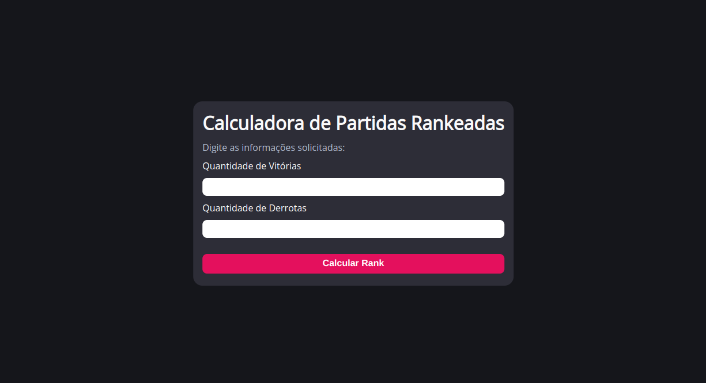

<h1 align="center"> Desafio Calculadora de Partidas Rankeadas </h1>

Projeto desenvolvido para fins acadêmicos como proposto pela plataforma <a href="https://www.dio.me/">DIO.me</a>.

  <a href="#-tecnologias">Tecnologias</a>&nbsp;&nbsp;&nbsp;|&nbsp;&nbsp;&nbsp;
  <a href="#-projeto">Projeto</a>&nbsp;&nbsp;&nbsp;|&nbsp;&nbsp;&nbsp;
  <a href="#memo-licença">Licença</a>

  

 

  

## 🚀 Tecnologias

Esse projeto foi desenvolvido com as seguintes tecnologias:

- HTML e CSS
- JavaScript
- Git e Github

## 💻 Projeto

# 2️⃣ Calculadora de partidas Rankeadas
 
Explorar todos os conceitos abordados sobre Variáveis, Operadores, Laços de repetição e Estruturas de decisões.

**O Que deveria ser utilizado**

- Variáveis
- Operadores
- Laços de repetição
- Estruturas de decisões
- Funções

## Objetivo

Criar uma função que recebe como parâmetro a quantidade de vitórias e derrotas de um jogador, depois disso retorna o resultado para uma variável, o saldo de Rankeadas deve ser feito através do calculo (vitórias - derrotas)

Se vitórias for menor do que 10 = Ferro 
Se vitórias for entre 11 e 20 = Bronze 
Se vitórias for entre 21 e 50 = Prata 
Se vitórias for entre 51 e 80 = Ouro 
Se vitórias for entre 81 e 90 = Diamante 
Se vitórias for entre 91 e 100= Lendário 
Se vitórias for maior ou igual a 101 = Imortal 

## Saída

Ao final deve se exibir uma mensagem:
"O Herói tem de saldo **{saldoVitorias}** e está no nível **{nivel}**"

- [Acesse o projeto finalizado, online](https://gabriellricardoo.github.io/dio-lab-calculadora-de-partidas/)

## :memo: Licença

Esse projeto está sob a licença MIT.

---

Layout feito com ♥ by GR
